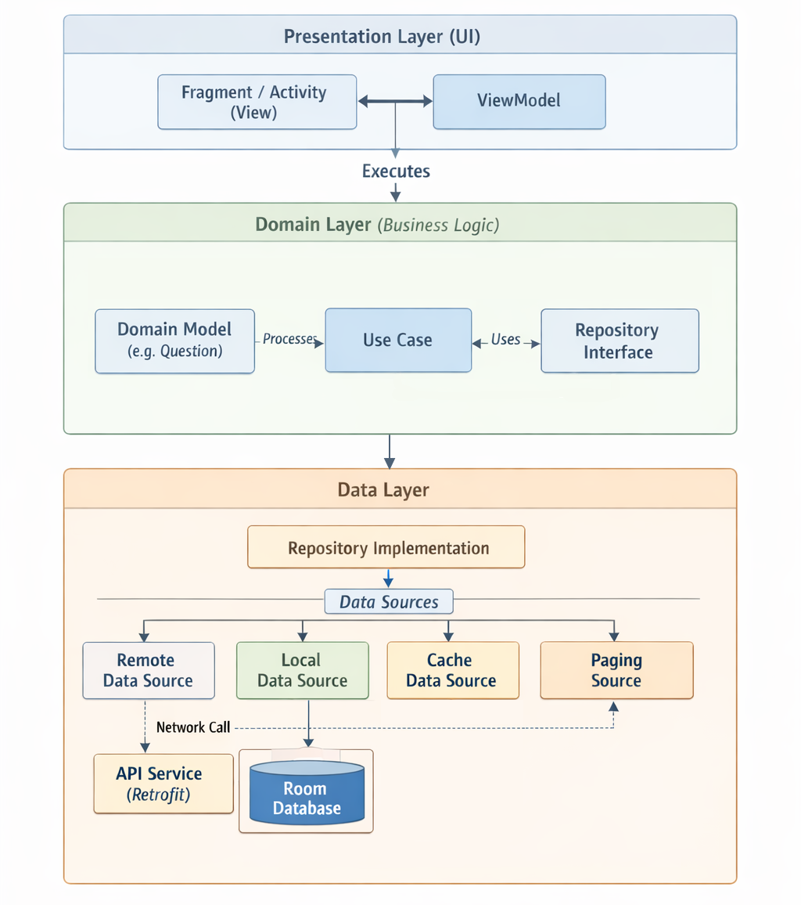

# 필로우톡(feeltalk)

## 👋 Introduce
💞 “자기는 이런게 좋아?”, “저런게 좋아?” 여러분은 연인과 이런 대화를 자주 나누시나요?   
가장 가까운 사이이지만, 깊은 대화를 나누기 어려워하는 연인들이 많다고 합니다.   
우리 앱은 **연인들이 스킨십에 대한 속깊은 이야기를 나눌 수 있도록 돕는 서비스** 입니다.

 

## 📱 Screen
### 1. 회원가입 & 로그인

* 필로우톡은 소셜 로그인 기반 인증 구조를 사용하여 로그인과 회원가입을 하나의 플로우로 통합했습니다. 인증 성공 시 사용자 존재 여부에 따라 계정을 생성하거나 로그인 처리하여 초기 진입 과정을 단순화했습니다.
* 성인 대상 서비스 특성상 휴대폰 본인 인증을 필수 단계로 포함하고 있으며, 인증 상태에 따라 화면 전환 및 다음 단계 접근을 제어합니다.
* 본인 인증 이후에는 닉네임을 설정하고, 커플 서비스 특성을 반영한 코드 기반 사용자 연결 구조를 제공합니다.

### 2. 시그널 전송

* 시그널 전송은 사용자의 현재 기분 상태를 상대방에게 전달하고, 서로의 상태를 간단하게 확인할 수 있도록 설계된 핵심 서비스입니다.
* 사용자는 자신의 시그널을 선택할 수 있으며, 선택된 시그널은 서버에 저장되어 커플로 연결된 상대방에게 전달됩니다.

### 3. 오늘의 질문

* 오늘의 질문은 커플 간 대화를 자연스럽게 유도하기 위해 매일 새로운 질문을 랜덤하게 제공하는 커뮤니케이션 기능입니다.
* 사용자는 질문에 대한 답변을 작성하고, 답변은 커플 관계로 연결된 상대방과 공유됩니다.
* 상대방이 아직 답변하지 않은 경우, ‘꼭 찌르기’ 기능을 통해 가벼운 방식으로 응답을 요청할 수 있습니다.

### 4. 챌린지

* 챌린지 등록은 커플이 함께 목표를 설정하고, 일정 기간 동안 이를 공유·실천할 수 있도록 지원하는 서비스입니다.
* 사용자는 챌린지를 직접 생성하고, 진행 중 / 완료 상태에 따라 목록을 구분해 관리할 수 있습니다.
* 완료된 챌린지는 히스토리 형태로 확인할 수 있어, 커플 간의 공동 경험 기록으로 기능하도록 설계했습니다

### 5. 화면잠금

* 화면 잠금은 커플 서비스 특성상 발생할 수 있는 민감 정보 노출을 방지하기 위한 보안 기능입니다.
* 잠금 활성화 시 앱 진입 또는 포그라운드 전환 시 비밀번호 입력을 요구하여 개인정보를 보호합니다.
* 비밀번호 분실 상황을 대비해 보안 질문 기반 비밀번호 재설정 기능을 제공합니다.

### 6. 탈퇴 & 헤어지기

* 필로우톡은 계정 탈퇴와 커플 관계 해제(헤어지기)를 분리하여 제공합니다.
* 탈퇴 시 사용자 계정 및 관련 데이터가 삭제되며 복구할 수 없습니다.
* 헤어지기는 계정을 유지한 채 커플 관계만 해제하는 기능으로, 관계 해제 전 데이터 처리 범위를 명확히 안내합니다.

 

## 🧱 Architecture & Design

### MVVM Architecture

필로우톡 프로젝트의 규모가 커져감에 따라 
프로젝트 설계 단계에서 복잡한 비동기 서버 통신과 UI 상태 관리가 어려울 것이라고 예상되어 
이를 안정적으로 처리하기 위해 MVVM Architecture를 적용했습니다.

### Clean Architecture

Presentation / Domain / Data 레이어를 분리하여
비즈니스 로직과 UI 로직의 책임을 명확히 하고,
데이터 흐름이 단방향으로 유지되도록 설계했습니다.

### Use Case Pattern

여러 Repository와 인증 토큰들(JWT)을 함께 다뤄야 하는 구조에서
UseCase를 중심으로 흐름을 정리함으로써,
UI에서는 상태 변화에만 집중할 수 있도록 만들었습니다.

 

## 🛠️ Tech Stack
| **Category** | **Tech Stack** |
| --- | --- |
| **Language** |  |
| **Platform** |  |
| **Architecture** | ,  |
| **Async** | ,  |
| **Dependency Injection** |  |
| **Networking** | , ,  |
| **Local Data** | ,  |
| **Jetpack** | , ,  |
| **Auth** | , , ,  |
| **Analytics** |  |
| **Push** |  |

 

## 🔗 Links

- **Notion**  
  https://feeltalk.notion.site/PILLOW-TALK-338b1e6005284e34b982425f2fb9fbb5
