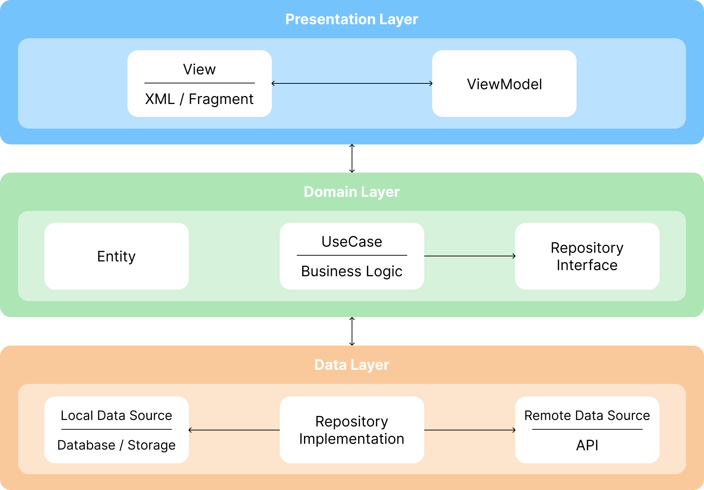

# 필로우톡(feeltalk)

## ⚠️ Project Status
현재 백엔드 서버가 종료되어 실제 네트워크 기능은 실행할 수 없습니다.
플레이스토어 배포도 종료된 상태입니다.
본 리포지토리는 아키텍처 설계와 구현 방식을 확인할 수 있도록 코드를 공개합니다.

 

## 👋 소개
💞 “자기는 이런게 좋아?”, “저런게 좋아?” 여러분은 연인과 이런 대화를 자주 나누시나요?   
가장 가까운 사이이지만, 깊은 대화를 나누기 어려워하는 연인들이 많다고 합니다.   
우리 앱은 **연인들이 스킨십에 대한 속깊은 이야기를 나눌 수 있도록 돕는 서비스**입니다.

 

## 📱 스크린
### 1. 회원가입 & 로그인

- 필로우톡은 소셜 로그인 인증을 사용하여 로그인과 회원가입을 하나의 플로우로 통합했습니다. 인증 성공 시 유저의 회원가입 여부에 따라 계정을 생성하거나 로그인 처리하여 전체 과정을 단순화했습니다.
- 성인 대상 서비스 특성상 휴대폰 본인 인증을 필수로 포함하고 있으며 인증이 완료되면 다음 단계로 이동합니다.
- 본인 인증 이후에는 닉네임을 설정하고 커플 초대 코드를 통해 커플 연결을 제공합니다.

### 2. 시그널 바꾸기

- 시그널 바꾸기 유저의 현재 기분 상태를 상대방에게 전달하고 서로의 기분을 간단하게 확인할 수 있도록 설계된 기능입니다.
- 유저는 자신의 시그널을 선택할 수 있으며 선택된 시그널은 커플로 연결된 상대방에게 전달됩니다.

### 3. 오늘의 질문

- 오늘의 질문은 커플 간 대화를 자연스럽게 유도하기 위해 매일 새로운 질문을 제공하는 커뮤니케이션 기능입니다.
- 유저는 질문에 대한 답변을 작성하고 답변은 커플로 연결된 상대방과 공유됩니다.
- 상대방이 아직 답변하지 않은 경우 ‘콕 찌르기’ 기능을 통해 가벼운 방식으로 답변을 재촉할 수 있습니다.

### 4. 챌린지

- 챌린지 등록은 커플이 함께 목표를 설정하고 일정 기간 동안 이를 공유, 실천할 수 있도록 지원하는 서비스입니다.
- 유저는 챌린지를 직접 생성하고 진행 중 / 완료 상태에 따라 챌린지 목록을 구분해 관리할 수 있습니다.
- 완료된 챌린지는 히스토리 형태로 확인할 수 있어 커플 간의 기록으로 확인 가능하도록 설계했습니다.

### 5. 화면잠금

- 화면 잠금은 커플 서비스 특성상 발생할 수 있는 민감한 정보 노출을 방지하기 위한 보안 기능입니다.
- 잠금을 활성화하면, 앱 진입 때 비밀번호 입력을 요구하여 개인정보를 보호합니다.
- 비밀번호 분실 상황을 대비해 보안 질문을 통한 비밀번호 재설정 기능을 제공합니다.

### 6. 탈퇴 & 헤어지기

- 필로우톡은 계정 탈퇴와 커플 관계 해제(헤어지기)를 분리하여 제공합니다.
- 탈퇴 시 유저 계정 및 관련 데이터가 삭제되며 복구할 수 없습니다.
- 헤어지기는 계정을 유지한 채 커플 관계만 해제하는 기능으로 일정 기간 내 커플로 재연결 하지 않을 시 데이터가 삭제됩니다.

 

## 👤 담당 역할

- Android 개발 전담
    - 앱 아키텍쳐 설계
    - 주요 기능 구현
- AES/RSA 기반 종단간 암호화 구조 설계 전담
- 인증 및 API 연동 설계 협업 (약 40% 기여)
    - API 스펙 정의
    - JWT 기반 로그인 인증 플로우 설계

 

## **🔥 주요 구현 포인트**

### 인증 / 보안 설계

- JWT를 이용한 회원가입과 로그인 Stateless 인증 관리
- RSA 및 AES 를 이용한 혼합 암호화 구조 설계, Android KeyStore를 통한 구현
- Android WebView를 사용해 Apple Sign-In 우회 구현

### 상태 / 데이터 흐름 관리

- Resource 클래스를 정의해 데이터 로딩 시의 성공/실패 상태를 명확히함
- Remote + Local 데이터 캐싱을 이용한 로딩 지연 최소화
- Paging 3를 활용한 페이지네이션으로 대용량 데이터 처리

### UI / UX

- MotionLayout, Lottie 등을 활용해 복잡한 애니메이션 구현
- Snackbar, Dialog, Button 등의 커스텀 UI 제작으로 UX 개선
- Firebase Cloud Messaging(FCM)을 통한 실시간 알림

 

## 🏗️ 아키텍쳐

### Clean Architecture

- Presentation / Domain / Data의 3개의 계층으로 분리하여 책임을 명확히 함
- 핵심 비즈니스 로직(Domain)을 외부 환경(UI, DB, API) 변화로부터 보호하기 위해 Presentation과 Data 계층이 Domain 계층을 향하는 단방향 의존성을 가도록 설계
- 비즈니스 로직이 데이터 소스의 구체적인 구현에 의존하지 않도록 Domain 계층에서 인터페이스로 정의하고 Data 계층에서 이를 구현하는 의존성 역전 원칙(DIP)을 적용

### MVVM Architecture

- UI 로직과 상태 관리를 분리하기 위해 MVVM을 도입
- ViewModel은 UI의 생명주기와 분리되어 화면 회전과 같은 UI 변경에도 UI 상태를 안전하게 보존해줌

### UseCase Pattern

- ViewModel이 여러 Repository를 직접 참조하고 비즈니스 로직을 조합해야 하는 복잡성을 해결하기 위해 UseCase 패턴을 적용
- 단일한 책임을 갖는 개별 기능을 UseCase 클래스로 캡슐화하여 비즈니스 로직 흐름을 명확하게 정의하고 재사용성을 높임

 

## 🛠️ 기술 스택

| **Category** | **Tech Stack** |
| --- | --- |
| **Language** |  |
| **Platform** |  |
| **Architecture** | ,  |
| **Async** | ,  |
| **Dependency Injection** |  |
| **Networking** | , ,  |
| **Local Data** | ,  |
| **Jetpack** | , ,  |
| **Auth** | , , ,  |
| **Push** |  |

 

## **🧩 문제 해결 경험**

### **🔹안드로이드에서의 Apple** Sign-In **미지원 문제**

**문제점**

- Apple Sign-In은 iOS와 Web 환경에서만 공식 지원
- iOS에서 Android로 기기 변경 시 계정 이전이 불가능한 문제가 발생

**해결 방법**

- Android WebView + 서버를 활용해 우회 로그인 구조 설계
- Apple Sign-In 웹페이지를 호출할 때 redirect_uri를 서버로 지정하여 인증 정보를 서버에서 직접 수신 가능
- redirect_uri에 클라이언트가 생성한 UUID를 파라미터로 서버에 같이 전달
- 클라이언트에서 생성한 UUID를 가지고 서버에서 애플 인증 정보를 매칭 가능

**결과**

- Android에서도 Apple 계정으로 로그인 가능
- 클라이언트는 UUID를 통해 서버에서 인증 결과를 조회
- 기존에 안드로이드를 지원하지 않는 인증 플랫폼을 웹으로 우회 구현하는 방법을 배움

### **🔹종단간 암호화 구현 도중** RSA 암호화의 텍스트 길이 제한 문제

**문제점**

- RSA는 키 크기보다 암호화 하려는 데이터의 크기가 작아야 함
- 암호화 가능한 데이터 길이에 제한이 존재해 긴 텍스트를 암호화 할 수 없음

**해결 방법**

- AES와 RSA를 혼합해서 적용
    - 타겟 텍스트를 랜덤 생성한 AES 키로 암호화
    - AES 키를 RSA 공개키로 암호화
- 두 암호화된 텍스트를 하나의 텍스트 채팅으로 묶어서 서버로 전송

**결과**

- 문장의 길이 제한 없이 암호화가 가능해짐
- RSA의 단점을 보완한 구조를 만들어서 암호화의 안정성이 더욱 상승함

### **🔸**종단간 암호화 기능의 유지보수 및 서비스 방향성 변경 결정

**문제**

- 키 관리 로직이 복잡해서  유지보수 비용이 증가함
- 커플 양측이 동시에 데이터 손실로 인한 개인키를 분실하면 복호화가 불가능하다는 리스크 존재

**결정 배경**

- 유저들은 암호화 기능의 필요성을 크게 느끼지 않음
- 기존 종단간 암호화 채팅 앱(텔레그램 등)에 대한 사회적 인식 악화

**결론**

- 암호화 기능은 MVP 버전까지만 유지
- Release 버전에서는 기능 제거

 

## **🔄 개선 방향**

### 🔹 Data Layer 오버 엔지니어링 문제

**문제**

- Data Layer 내부의 DataSource마다 interface를 만들어 놓음
- 불필요한 boilerplate 코드 증가

**개선 방향**

- DataSource는 어차피 외부(Domain, Presentation)에 노출되지 않으므로 interface 제거

**배운 점**

- Clean Architecture를 사용하는 이유는 유지보수를 어렵게 하기 위함이 아닌
  쉽게 하기 위함이므로 너무 엄격하고 지엽적인 코드 작성은 오버 엔지니어링이 될 수 있다는 것을 배움

### 🔹 JWT 토큰 관리 방식 개선 필요

**문제**

- API 호출 시마다 토큰 만료 여부를 UseCase에서 직접 체크
- boilerplate 코드 증가 및 유지보수 비용 증가

**개선 방향**

- 인증 로직을 Data Layer의 네트워크 호출 코드로 위임
- OkHttp Interceptor를 사용하여 토큰 자동 갱신 처리

**배운 점**

- 반복되는 네트워크 호출에 동일한 로직을 일관적으로 적용해주는 OkHttp Interceptor를 새로 알게됨

### 🔹 실시간 채팅 구조의 한계

**문제**

- 실시간 채팅 기능을 Firebase Cloud Messaging(FCM) 기반으로 구현
- FCM 기반 메시지는 실시간으로 명확하게 보내는 것이 아니라 메시지간의 순서를 보장하기 어려움
- 사용량 증가 시 파이어베이스 비용이 부담됨

**개선 방향**

- 실시간 채팅 로직을 WebSocket 기반으로 전환 예정
- FCM은 백그라운드 알림 용도로만 유지

**배운 점**

- FCM으로 받은 데이터는 포어그라운드 UI를 띄우지 않고 백그라운드에서 처리가 가능하다는 것을 알게 됨
- WebSocket은 FCM과 달리 연결 상태를 자동으로 관리해주지 않기 때문에
  Ping-Pong 프레임을 처리하는 등 Keep-alive 메커니즘을 활용한 연결 유지 로직을 직접 설계해야하지만
  덕분에 채팅 읽음 처리 등의 기능을 더 손쉽게 구현 가능하다는 것을 알게 됨

 

## 🔗 링크

- **Notion**  
  https://bouncy-rover-a1d.notion.site/2e0f88e182a580f8b46ffe06d1ac7578
